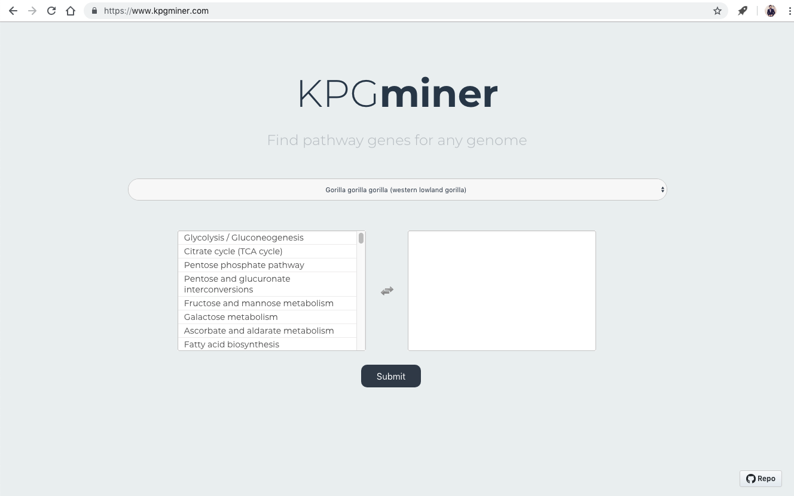
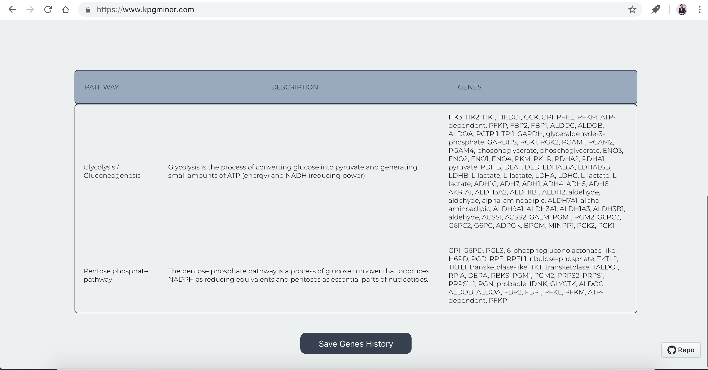
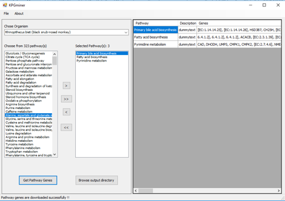

# KPGminer

> Soham Mehta, Rohan Mandloi, Akshay Satam and Gulshan Bhatia, Dr. Rob Patro

> Department of Computer Science, Stony Brook University.

KPGMiner is a tool to retrieve the constituent genes in KEGG pathways for different organisms and to organize information for pathway analysis pipelines. 

Project Link: https://www.kpgminer.com/

Project Paper: https://goo.gl/wsWDNH

## Introduction and Motivation

Previously, a tool known as [KPGminer](https://www.biorxiv.org/content/early/2018/09/13/416131) was developed by Mr.Azad at the University of NSW, Australia. With the Web and UI development, we at Stony Brook University have developed a open source version of KPGminer that can be used by anyone simply using their web browser. It relieves the user from hassel of installing any program for a specific set of OS. It finds the pathway genes and its relevant information from the KEGG pathway database. The UI developed is simple and intuitive and can be easily understandable by the practitioners.

## Previous Work

The tool that known as [KPGminer](https://www.biorxiv.org/content/early/2018/09/13/416131) was developed earlier for only WindowsOS which had to be installed expilictly. It required to be downloaded and was working only for specific version of OS.Though the tool retrieves the information of the pathway genes, there are many disadvantages pertaining to its implementation. The information retrieved abstracts the lower level implementation of the tool. Another limitation of this tool is that in batch mode i.e. for multiple pathways operation, it creates HTTP web request for each path separately. This is quite time consuming. However, these limitations are overcome by our implementation of open source version of the KPGminer tool. 

 

## User Steps

Our implementation of KPGminer tool is an open source, cloud-based website having good quality and simple user interface along with clear, concise and legible content/information. The website developed is better than the tool because it does not utilize any memory in the local directory like the application tool which was required to be downloaded to use. Any user with the website link can easily access KPGminer and hence, the KEGG database to retrieve the information of the pathway genes

1. Go to the website https://www.kpgminer.com/. 
2. Select an organism from the drop-down list.
3. Select/Deselect the pathways from the selection box. Right selection box indicates all the selected pathways.
4. Click on Submit button to view all the pathway genes of the selected pathways.
5. Click on Save Genes History to save the data in the local directory.

##	Conclusion

As part of this project, we also found out pain-points in current research work around pathway genes and tried to build an open-source tool to solve the same. While building the tool, we learnt a few terminologies in Biology and their significance. We also learnt that how  we can get useful information about genes, by firing correct REST APIs. There were a few technical learnings, like building a Website, using modern technologies like HTML,CSS and Javascript.

##	Acknowledgements

We would like to thank Prof. Rob Patro for his continuous guidance and suggestions during the implementation of the project. We learnt new concepts and techniques relevant to Bio-informatics and learnt how to overcome the engineering problems faced. We would also express our gratitude to the team, which exposed the REST APIs to the KEGG database. The APIs made our task easier.

## References

1.	Azad, A. K. M. (2018) KPGminer: A tool for retrieving pathway genes from KEGG pathway database. BMC Bioinformatics, 8, 5
2.	https://www.kegg.jp/kegg/rest/keggapi.html

